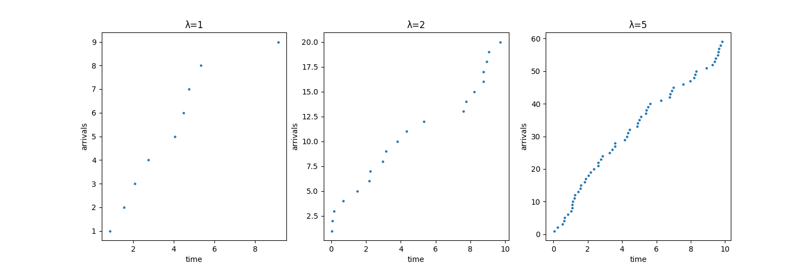

### 第10周作业

2、
$$
X(t)=0\iff Y(t)为奇数
\\X(t)=1\iff Y(t)为偶数
\\P(X(t)=0)=\sum_{k}\frac{(\lambda t)^{2k+1}}{(2k+1)!}e^{-\lambda t}=\frac{e^{\lambda t}-e^{-\lambda t}}{2} e^{-\lambda t}=\frac{1-e^{-2\lambda t}}{2}
\\P(X(t)=1)=\sum_{k}\frac{(\lambda t)^{2k}}{(2k)!}e^{-\lambda t}=\frac{e^{\lambda t}+e^{-\lambda t}}{2} e^{-\lambda t}=\frac{1+e^{-2\lambda t}}{2}
$$

3、
第6章第8题：
$$
\begin{aligned}
    在早上8点-9点，P(发生事故次数=k)&=\frac{(5\times 1)^k}{k!}e^{-5\times 1}
    \\&=\frac{5^k}{k!}e^{-5}    
    \\在早上9点-11点，P(发生事故次数=m)&=\frac{(3\times 2)^m}{m!}e^{-3\times 2}
    \\&=\frac{6^m}{m!}e^{-6}   
    \\P(发生事故总次数=n)&=\sum_0^n \frac{5^k}{k!}e^{-5} \frac{6^{n-k}}{(n-k)!}e^{-6}
    \\&=e^{-11}\frac{6^n}{n!}\sum_0^nC_n^k(\frac{5}{6})^k
    \\&=e^{-11}\frac{6^n}{n!}(\frac{11}{6})^n
    \\&=\frac{11^n}{n!}e^{-11}
\end{aligned}
$$

第9题：
$$
5个网球场，平均等待时间40分钟\iff1个网球场，平均等待时间8分钟
\\期望等待时间t=8(k+1)
$$

第10题：
(a)
$$
\begin{aligned}
    P(首次钓到鱼的时间>2h)&=P(N(2h)=0)
    \\&=\frac{(0.6\times 2)^0}{0!}e^{-0.6\times 2}
    \\&=e^{-1.2}
\end{aligned}
$$

(b)
$$
\begin{aligned}
    钓鱼总时间在2～5小时\iff &第一条鱼钓得时间在2～5小时
    \\P(N(2h)=0)&=e^{-1.2}
    \\P(N(5h)-N(2h)>1)&=1-P(N(3h)=0)
    \\&=1-\frac{(0.6\times3)^0}{0!}e^{-0.6\times3}
    \\&=1-e^{-1.8}
    \\且P(N(2h)=0)与P(N(5h&)-N(2h)=1)是独立增量
    \\P&=e^{-1.2}\times(1-e^{-1.8})
    \\&=0.251
\end{aligned}
$$

(c)
$$
P(N(2h)=1)=\frac{(0.6\times 2)^1}{1!}e^{-0.6\times2}=1.2e^{-1.2}
\\
\begin{aligned}
    P(N(2h)\ge 2)&=1-P(N(2h)=0)-P(N(2h)=1)
    \\&=1-e^{-1.2}-1.2e^{-1.2}
    \\&=0.337
\end{aligned}
$$

(d)
$$
在前2小时，钓鱼条数的期望是0.6\times 2=1.2
\\继续钓下去的概率是e^{-1.2}，期望条数是1\times e^{-1.2}=e^{-1.2}
\\钓鱼期望数=1.2+e^{-1.2}=1.501
$$

(e)
$$
他在前4小时没有钓到鱼，从第4小时开始，钓上第1条鱼时间t～Exp(0.6)
\\E(t)=\frac{1}{0.6}=\frac{5}{3}
\\在已经钓鱼4小时条件下的总钓鱼时间期望为=4+\frac{5}{3}=5.667
$$

第11题：
(a)
$$
单位时间内买书后离开的顾客服从强度为p\lambda 人/小时的泊松分布
\\卖出第一本书的时间T\sim Exp(p\lambda)
$$

(b)
$$
\begin{aligned}
    P(N(1h)=0)&=\frac{(p\lambda)^0}{0!}e^{-p\lambda}
    \\&=e^{-p\lambda}
\end{aligned}
$$

(c)
$$
单位时间内买书后离开的顾客服从强度为p\lambda 人/小时的泊松分布
\\E(单位时间内买书后离开的顾客)=p\lambda
$$

4、
