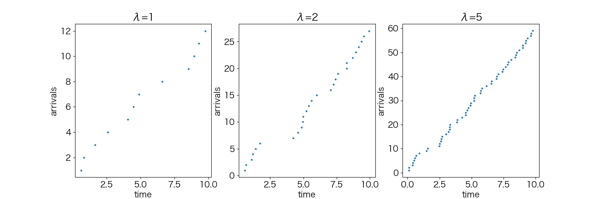
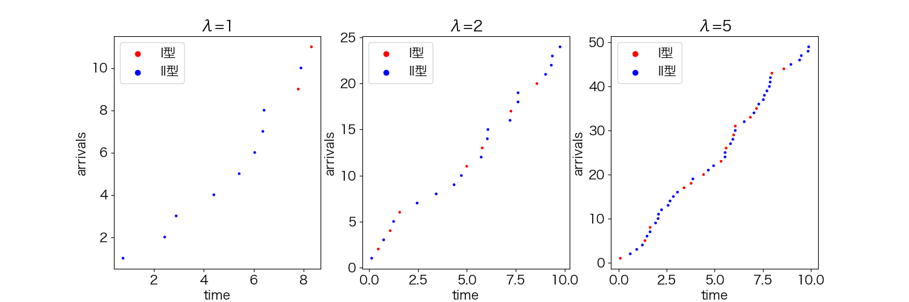

### 第11周作业

#### 1、
##### 6-12：
$由泊松过程的分裂性质，每个披萨饼均可看成以概率\frac{1}{n}在顾客买一个饼时发生的特殊事件，因此每个披萨饼的到达率是\frac{\lambda}{n}$
$一个披萨饼没有被人买的概率为P(k=0)=\frac{(\lambda/n)^0}{0!}e^{-\frac{\lambda}{n}}=e^{-\frac{\lambda}{n}}$
$一个披萨饼被人买的概率为P(k>0)=1-e^{-\frac{\lambda}{n}}$
$对n个饼，购买个数n\sim B(n,1-e^{-\frac{\lambda}{n}}),E(n)=n(1-e^{-\frac{\lambda}{n}})$

##### 6-13
(a)
$$
总到达率为\lambda=\lambda_A+\lambda_B
\\在时间t内，到达数量X满足P(X=k)=\frac{(\lambda t)^k}{k!}e^{-\lambda t}
\\当k=9时，P(X=9)=\frac{((\lambda_A+\lambda_B) t)^9}{9!}e^{-(\lambda_A+\lambda_B) t}
$$

(b)
$$
X\sim P((\lambda_A+\lambda_B)t)
\\E(W)=\frac{2}{6} \times 1 + \frac{3}{6} \times 2 + \frac{1}{6} \times 3=\frac{11}{6}
\\由W与X的独立性，E(N)=E(X)E(W)=\frac{11}{6}(\lambda_A+\lambda_B)t
$$

(c)
$$
由泊松过程的分裂性质，收到来自A的字数为3的信息到达率为\frac{\lambda_A}{6}
\\设T_k为第k次到达的时间，f_{T_k}(t)=\Gamma(k,\frac{\lambda_A}{6})=\frac{(\lambda_A/6)^kt^{k-1}}{(k-1)!}e^{-\lambda_At/6}
\\代入k=8,f_{T_k}(t)=\frac{(\lambda_A/6)^8t^7}{7!}e^{-\lambda_At/6}
$$

(d)
$$
来自发报机A的概率为\frac{\lambda_A}{\lambda_A+\lambda_B}
\\在12条信息中，来自A的信息条数Y\sim B(12,\frac{\lambda_A}{\lambda_A+\lambda_B})
\\恰好有8条来自发报机A的概率P(Y=8)=C_{12}^8(\frac{\lambda_A}{\lambda_A+\lambda_B})^8(\frac{\lambda_B}{\lambda_A+\lambda_B})^4
$$

#### 2、
(1)
$在时间t,下标i过程没有到达的概率为P(k=0)=e^{-\lambda_it}$
$所有事件都没到达的概率为e^{-(\lambda_1+\lambda_2+\cdots+\lambda_n)t},记\lambda=\sum_{i=1}^n\lambda_i,P=e^{-\lambda t}$
$至少到达一个过程的cdf=1-e^{-\lambda t},pdf=\lambda e^{-\lambda t}$

(2)
$a.N(0)=0$
$b.N(t)=\sum_{i=1}^nN_i(t)为独立增量，因为其每个分量都是独立增量$
$c.N(t+s)-N(s)=\sum_{i=1}^nN_i(t+s)-N_i(s)=\sum_{i=1}^nX_i,X_i\sim P(\lambda_i t)$
$X=\sum_{i=1}^nX_i\sim ~ P(\sum_{i=1}^n\lambda_it),因此N(t+s)-N(s)\sim P(\sum_{i=1}^n\lambda_it)$

(3)
$$
设过程A的到达时刻是n个过程的到达时刻之和，A的到达率\lambda=\sum_{i=1}^n\lambda_i
\\T\sim Exp(\lambda)
\\P(T=t)=\lambda e^{-\lambda t}
$$

(4)
$$
\\P(min\{t_k\}=t_i)=\frac{\lambda_i}{\sum_{k=1}^n\lambda_k}
\\假设n=2，则过程1先发生的概率P(T_1<T_2)=\int_0^{+\infty}\int_{t_1}^{+\infty}\lambda_1e^{-\lambda_1 t_1}\lambda_2e^{-\lambda_2 t_2}dt_2dt_1=\frac{\lambda_1}{\lambda_1+\lambda_2}
\\当n=k成立，对n=k+1，由第(2)问可知前k个过程可视为到达率为\lambda=\sum_{i=1}^k \lambda_i的Poisson过程，
\\第1个发生的事件在前k个的概率是\frac{\lambda}{\lambda+\lambda_{k+1}},第1个发生的事件是第k+1的概率为\frac{\lambda_k}{\lambda+\lambda_k},其中\lambda=\sum_{i=1}^{k}\lambda_i
\\由条件概率和假设，第一个发生的事件是第i个(i\le k)的概率为P=\frac{\lambda_i}{\lambda}\frac{\lambda}{\lambda+\lambda_k}=\frac{{\lambda_i}}{\lambda+\lambda_k}
\\由数学归纳法可知对任意i\in N^+,P(min\{t_k\}=t_i)=\frac{\lambda_i}{\sum_{k=1}^n\lambda_k}
$$

#### 3、
(1)
$$
\begin{aligned}
    P(N(1)\le 3)&=P(N(1)=0)+P(N(1)=1)+P(N(1)=2)+P(N(1)=3)
    \\&=\frac{\lambda^0}{0!}e^{-\lambda}+\frac{\lambda^1}{1!}e^{-\lambda}+\frac{\lambda^2}{2!}e^{-\lambda}+\frac{\lambda^3}{3!}e^{-\lambda}
    \\&=(1+\lambda+\frac{\lambda^2}{2}+\frac{\lambda^3}{6})e^{-\lambda}
\end{aligned}
$$

(2)
$$
\begin{aligned}
    P(N(1)=1,N(3)=2)&=P(N(1)=1)P(N(3)-N(1)=1)
    \\&=P(N(1)=1)P(N(2)=1)
    \\&=\frac{\lambda^1}{1!}e^{-\lambda}\times\frac{(2\lambda)^1}{1!}e^{-2\lambda}
    \\&=2\lambda^2 e^{-3\lambda}
\end{aligned}
$$

(3)
$$
P(N(1)\ge 1)=1-P(N(1)=0)=1-e^{-\lambda}
\\
\begin{aligned}
    \\P(N(2)\ge 2, N(1)\ge 1)&=P(N(1)= 1)P(N(2)-N(1)\ge1)+P(N(1)\ge 2)
    \\&=\lambda e^{-\lambda}\times (1-e^{-\lambda})+\frac{\lambda^2}{2}e^{-\lambda}
\end{aligned}
\\P(N(2)\ge 2|N(1)\ge 1)=\frac{(\lambda+\frac{\lambda^2}{2})e^{-\lambda} - \lambda e^{-2\lambda}}{1-e^{-\lambda}}
$$

(4)
$$
当T_1=t_1,T_2=t_2,T_3=t_3,
\\pdf=\lambda e^{-\lambda t_1}\lambda e^{-\lambda (t_2-t_1)} \lambda e^{-\lambda (t_3-t_2)}=\lambda^3e^{-\lambda t_3}
$$

(5)
$$
\begin{aligned}
    E(N(t)N(t+s))&=E(N(t)(N(t)+(N(t+s)-N(t))))
    \\&=E(N(t)(N(t)+N(s)))
    \\&=E(N^2(t)+N(t)N(s))
    \\&=E(N^2(t))+E(N(t))E(N(s))
    \\&=(\lambda t)^2+\lambda t \lambda s
    \\&=\lambda^2(t^2+ts)
\end{aligned}
$$

#### 4、
$$
设第i名患者开始诊断的时间为T_i,第0名患者T_0=0
\\对i\ge 1.T_i\sim Exp(\lambda),\lambda=\frac{1}{8}(min^{-1})
\\
\begin{aligned}
    \\等待总时间T&=T_1+T_2+\cdots=\sum_{i=1}^{N(t),t=4h}T_i
    \\E(\sum_{i=1}^{N(t),t=4h}T_i)&=E(E(\sum_{i=1}^{N(t),t=4h}T_i|N(t)))
    \\E(\sum_{i=1}^{n}T_i|N(t)=n)&=E(\sum_{i=1}^nU_i)=\frac{nt}{2}=2n (h)
    \\E(2N(t))&=2\lambda t=2\times \frac{240}{8}=60(h)
\end{aligned}
$$

#### 5、
(1)
$$
不独立，设第1次到达发生在时间s,W_1=s
\\
\begin{aligned}
    \\P(W_2>t|W_1=s)&=P(N(s+t)-N(s)=0)=e^{m(s)-m(s+t)},其中m(t)=\int_0^t\lambda(t)dt
\\P(W_2\le t|W_1=s)&=1-e^{m(s)-m(s+t)}(cdf)
\\f(t)&=m'(s+t)e^{m(s)-m(s+t)}(pdf)
\\W_2的分布受到W_1影响，不独立
\end{aligned}
$$

(2)
$$
f(t)=1-e^{-m(t)},(W_1的pdf)，与W_2的pdf不同
\\因此没有相同分布
$$

#### 6、
(1)
$$
E(n)=30\times 5+210\times1=360
$$
(2)
$$
\begin{aligned}
    平均到达率为\lambda&=5\times\frac{1}{8}+1\times\frac{7}{8}=\frac{3}{2}
    \\P(N(t)>500)&=1-\sum_{k=0}^{500}P(N(t)=k)
    \\&=1-\sum_{k=0}^{500}\frac{360^k}{k!}e^{-360}
    \\&\approx1.3\times 10^{-12}
\end{aligned}
$$

#### 7、
(1)
$$
Z(t+s)-Z(s)=\sum_{i=N(t)}^{N(t+s)}X_i
\\因为X_i同分布，LHS=\sum_{i=N(0)}^{N(s)}X_i，这与t无关，有独立增量性
$$

(2)
$$
E(Z(t))=E(E(Z(t)|N(t)=n))=E(nE(X_i))=\lambda tE(X_i)
$$

(3)
$$
\begin{aligned}
    Var(Z(t))&=E(Z^2(t))-E^2(Z(t))
    \\&=E(\sum_{1\le i,j\le N(t)}X_iX_j)-E(Z(t))^2
    \\&=E(N^2(t)E^2(X_i))-(\lambda tE(X_i))^2
    \\&=E(X_i)^2\sum_{k=0}k^2\frac{(\lambda t)^k}{k!}e^{-\lambda t}-(\lambda tE(X_i))^2
    \\&=E(X_i)^2\sum_{k=0}(1+\frac{1}{k-1})\frac{(\lambda t)^k}{(k-2)!}e^{-\lambda t}-(\lambda tE(X_i))^2
    \\&=E(X_i)^2\sum_{k=0}(\frac{(\lambda t)^k}{(k-2)!}+\frac{(\lambda t)^k}{(k-1)!})e^{-\lambda t}-(\lambda tE(X_i))^2
    \\&=E(X_i)^2[(\lambda t)^2+\lambda t ]-(\lambda tE(X_i))^2
    \\&=\lambda tE(X_i)^2
\end{aligned}
$$

8、
(3)


(4)


```python
import numpy as np
import matplotlib.pyplot as plt
import matplotlib as mpl
mpl.rcParams['font.sans-serif'] = ['Hiragino Sans GB'] 
mpl.rcParams['font.size'] = 15  
mpl.rcParams['axes.unicode_minus'] = False  

def poisson_arrival_time(t, lamda):
    N = np.random.poisson(t * lamda)
    arrival_time = np.random.uniform(0, t, size=N)
    arrival_time = np.sort(arrival_time)
    return arrival_time

fig, axs = plt.subplots(1, 3, figsize=(15, 5))
axes = axs.flatten()

lambdas = [1, 2, 5]

def highlight_points(p, len):
    highlights = []
    for i in range(len):
        rand = np.random.uniform(0, 1)
        if rand < p:
            highlights.append(True)
        else:
            highlights.append(False)
    return highlights
        
for i in range(len(lambdas)):
    arrival_time = poisson_arrival_time(10, lambdas[i])
    height = np.arange(1, len(arrival_time) + 1)
    axes[i].scatter(arrival_time, height, marker='o', s=5)
    axes[i].set_title(f'λ={lambdas[i]}')
    axes[i].set_xlabel("time")
    axes[i].set_ylabel("arrivals")

plt.savefig('3.png')
for ax in axes:
    ax.clear()

for i in range(len(lambdas)):
    arrival_time = poisson_arrival_time(10, lambdas[i])
    highlights = highlight_points(0.3, len(arrival_time))
    colors = ['red' if h else 'blue' for h in highlights]
    height = np.arange(1, len(arrival_time) + 1)
    axes[i].scatter(arrival_time, height, marker='o', s=5, c=colors)
    
    axes[i].scatter([], [], color='red', label='I型')
    axes[i].scatter([], [], color='blue', label='II型')
    
    axes[i].legend()
    axes[i].set_title(f'λ={lambdas[i]}')
    axes[i].set_xlabel("time")
    axes[i].set_ylabel("arrivals")
    
plt.savefig('4.png')
```