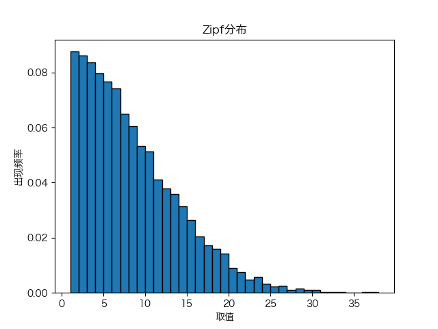

### 第14周作业

#### 1、
$$
\vec{\pi^{\prime}}=\vec{\pi}\underbar{P}
\\\pi^{\prime}_i=\sum_{k=1}^{M}\frac{P_{ki}}{M}=\frac{1}{M}
\\\pi^{\prime}=\pi
\\因此\vec{\pi}=\frac{1}{M}(1, \cdots, 1)为平稳分布
$$

#### 2、
$$
状态转移矩阵为\underbar{P}=
\left[\begin{array}{ll}
\frac{2}{9} & \frac{7}{9} \\
\frac{1}{2} & \frac{1}{2}
\end{array}\right]
$$

$$
\vec{\beta}=\vec{\beta}\underbar{P}
\\\vec{\beta}=[\frac{9}{23}\ \ \frac{14}{23}]
\\长期来看滞销概率为\frac{9}{23}，畅销概率为\frac{14}{23}
$$

#### 3、
(1)
$$
X_{n+1}-X_n=Y-Z
\\Y\sim P(\lambda),Z\sim B(X_n, p)
\\Y、Z与X_{n-1}时刻及以前的时刻无关，符合无后效性
$$

(2)
$$
设其平稳为\vec{\beta},\vec{\beta}=\vec{\beta}\underbar{P}
\\
\begin{aligned}
    \\X_0为平稳分布，E(X_0)&=\sum_{i=0}^{+\infty}i\beta_i
    \\X_1与X_0同分布，E(X_1)&=E(X_0)
    \\&=E(X_0)+E(Y)-E(Z)
    \\E(Y)&=E(Z)
    \\E(Z)&=\lambda,其中Z\sim B(X_0,p),X_0\sim P(\alpha)
    \\由随机过程的复合，Z&sim P(p\alpha)
    \\E(Z)=p\alpha=\lambda,\alpha&=\frac{\lambda}{p}
\end{aligned}
$$

(3)
$$
\begin{aligned}
该Markov链不可约，仅存在唯一平稳分布，即(2)中到达率为\frac{\lambda}{p}的泊松过程
\end{aligned}
$$

#### 4、
$
该随机游走显然没有后效性，可视为Markov链,$
$假设该无向网络没有孤立点，由无向性可知有边连接的2点可互达，$
$因此整个网络为等价类（若一个点与该等价类中任一点不连通，则是孤立点）$
$对于不可约链，存在唯一平稳分布$
$$
\\考虑分布\pi_i=\frac{\sum_j w_{i j}}{2\sum_{i,j} w_{i j}}
\\\pi_i P_{ij}=\frac{\sum_j w_{i j}}{2\sum_{i,j} w_{i j}}\times\frac{w_{i j}}{\sum_j w_{i j}}=\frac{w_{i j}}{2\sum_{i,j} w_{i j}}=\pi_j P_{ji}
$$
$因此分布\vec{\pi}=(\pi_i)为平稳分布$

#### 5、
(1)
$$
当X_n=i时，X_{n+1}=i+1或i-1,
\\P(X_{n+1}=i+1|X_n=i)=\frac{M-i}{M},
\\P(X_{n+1}=i-1|X_n=i)=\frac{i}{M}
\\P(X_{n+1}=i+1|X_n=i,X_{n-1}=j,\cdots,X_0=0)=\frac{M-i}{M}=P(X_{n+1}=i+1|X_n=i)
\\P(X_{n+1}=i-1|X_n=i,X_{n-1}=j,\cdots,X_0=0)=\frac{i}{M}=P(X_{n+1}=i-1|X_n=i)
\\{X_n}无后效性，为Markov链
$$

(2)
$$
\\P(i\rightarrow i+1)=P(X_{n+1}=i+1|X_n=i)=\frac{M-i}{M},
\\P(i\rightarrow i-1)=P(X_{n+1}=i-1|X_n=i)=\frac{i}{M}
\\\pi_i\times P(i\rightarrow i+1)=\left(\begin{array}{c}
M \\i\end{array}\right)\left(\frac{1}{2}\right)^M\times\frac{M-i}{M}
\\\pi_{i+1}\times P(i+1\rightarrow i)=\left(\begin{array}{c}
M \\i+1\end{array}\right)\left(\frac{1}{2}\right)^M\times\frac{i+1}{M}=\pi_i\times P(i\rightarrow i+1)
\\因此，对可一步转移的状态i、j,\pi_i P_{i j}=\pi_j P_{j i}
\\对不可一步转移的状态i、j,P_{i j}=P_{j i}=0,\pi_i P_{i j}=\pi_j P_{j i}仍成立
\\分布\vec{\pi}满足可逆性，是平稳分布
$$

(3)
$$
该过程可类比二项分布B(M,\frac{1}{2})，每个球以概率\frac{1}{2}出现在左边或右边
$$

#### 6、


```python
import math
import numpy as np
import matplotlib.pyplot as plt
import matplotlib as mpl
mpl.rcParams['font.sans-serif'] = ['Hiragino Sans GB'] 
mpl.rcParams['font.size'] = 10  
mpl.rcParams['axes.unicode_minus'] = False 

def Zipf(a=1, iter_epoch=100):
    state = 1
    for i in range(iter_epoch):
        a_add1 = math.pow(min(i / (i + 1), 1), a)
        if i > 1:
            a_sub1 = math.pow(min(i / (i - 1), 1), a)
        if state == 1:
            rand = np.random.uniform(0, 1)
            if rand < a_add1 * 0.5:
                state += 1
        
        else:
            rand = np.random.uniform(0, 1)
            if rand < a_add1 * 0.5:
                state += 1
            elif rand > 1 - a_sub1 * 0.5:
                state -= 1
    
    return state

samples = []

for i in range(10000):
    samples.append(Zipf(1, iter_epoch=100))
plt.hist(samples, bins=len(set(samples)), edgecolor='black', density=True)

plt.title('Zipf分布')
plt.xlabel('取值')
plt.ylabel('出现频率')
plt.savefig("6.png")
plt.show()