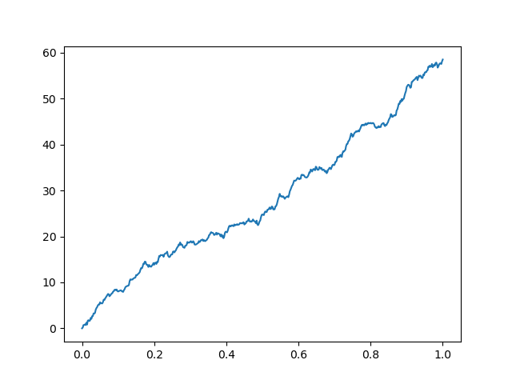

### 第15周作业

#### 1、
(1)
$$
B(t)\sim N(0, t)
\\P(B(2)>0)=0.5
$$

(2)
$$
B(t-s)\sim N(0, t-s),2B(s)\sim N(0, 4s)
\\
\begin{aligned}
    B(t)+B(s)&=B(t-s)+2B(s),且B(t-s)和B(s)独立
    \\&=N(0, t + 3s)
\end{aligned}
$$

(3)
$$
P(B(1)>0)=0.5
\\
\begin{aligned}
    P(B(1)>0,B(2)>0)&=P(B(1)>0,B(2)-B(1)>-B(1))
    \\设X_1=B(1),X_2=B(2)-B(1),则有LHS&=P(X_1>0,X_2>-X_1),
    \\且X_{1/2}\sim N(0, 1)
    \\P(X_1>0,X_2>-X_1)&=\int_0^{+\infty}\int_{-x_1}^{+\infty}f(x_1)f(x_2)dx_1dx_2
    \\&=\int_0^{+\infty}f(x_1)(1-\varPhi(-x_1))dx_1
    \\上面的积分比较困难，考虑P(X_2<-X_1|X_1>0)&=0.5(X_2是负数)\times0.5(X_2绝对值更大)=0.25
    \\P(B(1)>0,B(2)>0)&=P(X_1>0)P(X_2>-X_1|X_1>0)=0.5\times(1-0.25)=0.375
\end{aligned}
\\P(B(2)>0, B(1)>0)\neq P(B(1)>0)\times P(B(2)>0)，不独立
$$

(4)
$$
设X_1=B(1),X_2=B(2)-B(1), X_3=B(3)-B(2)
\\考虑3维空间x<0,x+y<0,x+y+z<0围成的面积占比为\frac{1}{3}
$$

#### 3、
$$
设T_a为a的首中时刻
P(T_a\le t)=2P(B(t)\ge a)=2(1-\varPhi(\frac{a}{\sqrt{t}}))\rightarrow1,t\rightarrow+\infty
$$

#### 4、
(1)
$$
E(Z(t))=E(X(t))-tE(X(1))=0
$$

#### 5、
(1)
$由Brown的Markov性质，在s时刻之后的事件仅与s时刻的状态有关$
$由对称性，s时刻后状态的均值为s时刻的值Y(s)$

(2)
$$
B(t)=B(s)+X,X\sim N(0,t-s)
\\
\begin{aligned}
    E(Y(t)|Y(u),0\le u\le s)&=E((B(s)+X)^2)-t
    \\&=B(s)^2+E(2B(s)X)+X^2-t
    \\&=B(s)^2+t-s-t
    \\&=B(s)^2-s=Y(s)
\end{aligned}
$$

(3)
$$
\begin{aligned}
    E(Y(t))&=E(e^{-\frac{1}{2}\sigma^2 t + \sigma B(t)})
    \\&=Y(s)E(e^{-\frac{1}{2}\sigma^2 (t-s) + \sigma X}),X\sim B(0, t-s)
    \\&=Y(s)\int_{-\infty}^{+\infty}e^{-\frac{1}{2}\sigma^2 (t-s) + \sigma X}f(X)dX
    \\&=Y(s)\int_{-\infty}^{+\infty}e^{-\frac{1}{2}\sigma^2 (t-s) + \sigma X}\frac{1}{\sqrt{2\pi}\sigma}e^{\frac{X^2}{2\sigma^2}}dX
    \\&=Y(s)\int_{-\infty}^{+\infty}\frac{1}{\sqrt{2\pi}\sigma}e^{-\frac{x^2-2\sigma (t-s)+\sigma^2(t-s)^2}{2(t-s)}}dX
    \\&=Y(s)\int_{-\infty}^{+\infty}\frac{1}{\sqrt{2\pi}\sigma}e^{-\frac{(x-(t-s))^2}{2(t-s)}}dX
    \\&=Y(s)
\end{aligned}
$$

8、


```python
import numpy as np

def generate_drift_brownian_motion(T, N, mu, sigma, n):
    """
    Generate n paths of a drift brownian motion.
    
    Parameters:
    T: total time
    N: number of time steps
    n: number of paths
    mu: drift term
    sigma: standard deviation of the random term
    
    Returns:
    B: a (n, N+1) array of n paths of the brownian motion
    """
    dt = T/N
    # Initialize the brownian motion
    B = np.zeros((n, N+1))
    # Generate the brownian motion
    for i in range(n):
        B[i, 1:] = mu * dt + sigma * np.sqrt(dt) * np.random.standard_normal(size=N)
    return np.cumsum(B, axis=1)

# Test the function
B = generate_drift_brownian_motion(T=50, N=500, mu=1, sigma=1, n=1)

# Plot the result
import matplotlib.pyplot as plt
for i in range(B.shape[0]):
    plt.plot(np.linspace(0, 1, 501), B[i])
plt.savefig('8.png')
plt.show()
