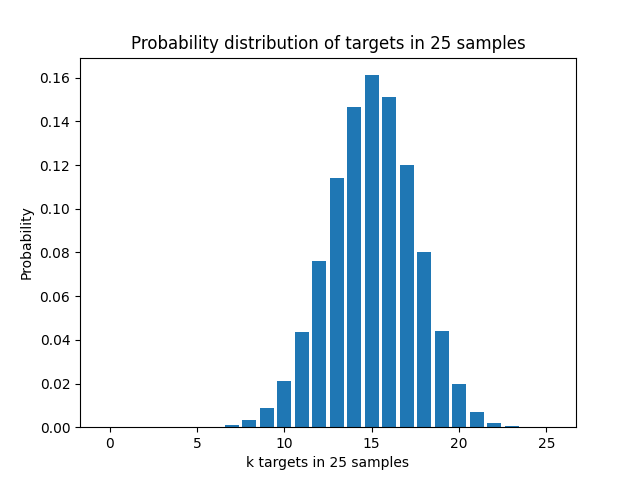

## 第3周作业
#### 1、
序号|随机变量|类型|样本空间|
|:-:|-|-|-|
|1|50个人中男性个数|离散型|$2^{50}$个50元组|
|2|0-1中的一个随机数|连续型|$[0,1]$|
|3|100个培养皿中某一个的细菌数|离散型|所有培养皿构成的集合|
|4|某个人的收入|连续型|所有人构成的收入构成的集合|
|5|随机调查50人对某题评分(1-5分)|离散型|$5^{50}$个50元组|

#### 2、
###### (1)
$(\Omega,\mathscr{F}, P)$为概率空间，对于随机变量$X$，设$S_n=\{t\in \Omega, X(t)<-n\}$,则有$S_1\supset S_2\supset S_3\cdots\supset S_n\cdots$
注意到$lim_{n\rightarrow \infty}S_n=\varnothing$，因为若其不为$\varnothing$，则$\exist t\in \Omega$，满足$X(t)<n,\forall n > 0$，矛盾
$$
\begin{aligned}
lim_{x\rightarrow -\infty}F(x)&=lim_{n\rightarrow\infty}P(x\in S_n)\\
&=P(x\in \varnothing)\\
&=0
\end{aligned}
$$

设$S_n^{'}=\{t \in \Omega, X(t)>n\}$，同样有$S_1\supset S_2\supset S_3\cdots\supset S_n\cdots$，且$lim_{n\rightarrow \infty}S_n=\varnothing$
$$
\begin{aligned}
lim_{x\rightarrow +\infty}F(x)&=lim_{n\rightarrow\infty}P(x\in {(S_n^{'})}^C)\\
&=P(x\in (\varnothing)^C)\\
&=P(\Omega)\\
&=1
\end{aligned}
$$

###### (2)
要证$F(x)$右连续，即$lim_{t \rightarrow x^+}F(t)=F(x)$，由海涅定理，只要证对任意从右侧逼近$x$的数列$a_n$，$F(a_n)\rightarrow F(x)$。

$$
F(x+t)-F(x)=P(x<X\le x+t)\ge 0
$$
因此$F(x)$是一个单调增函数，有界单调数列数列必有极限，因此$F(a_n)$存在且唯一。
因此只要证明存在一个数列$a_n\rightarrow x^+,F(a_n)\rightarrow F(x)$即可
取$a_n=x+\frac{1}{n}$，$F(a_n)-F(x)=P(x<X \le x+\frac{1}{n}) $，当$n\rightarrow\infty,(x,x+\frac{1}{n}]=\varnothing$，因此有：
$$
lim_{n\rightarrow \infty}F(a_n)-F(x)=0
$$
所以$a_n\rightarrow x^+,F(a_n)\rightarrow F(x)$,从而$F(x)$右连续

###### (3)
$$
\begin{aligned}
P(a\le x\le b)&=P(a)+P(a<x\le b)\\
&=lim_{n\rightarrow\infty}P(a-\frac{1}{n} <x\le a)+F(b)-F(a)\\
&(因为lim_{n\rightarrow\infty}(a-\frac{1}{n}, a]=\{a\})\\
&=F(a)-lim_{n\rightarrow\infty}F(a-\frac{1}{n})+F(b)-F(a)\\
&=F(b)-lim_{x\rightarrow a-}f(x)
\end{aligned}
$$

#### 4、
###### (1)
$$ \left\{
\begin{aligned}
P(\omega_1)+P(\omega_2)+P(\omega_3)=1 \\
P(\omega_1)=P(\omega_2)=P(\omega_3) \\
\end{aligned}
\right.
$$
可得$P(\omega_1)=P(\omega_2)=P(\omega_3)=\frac{1}{3}$
$X,Y$均满足以下分布：
|X/Y|1|2|3|
|:-:|:-:|:-:|:-:|
|$P$|$\frac{1}{3}$|$\frac{1}{3}$|$\frac{1}{3}$|

###### (2)
|$X+Y$|3|4|5|
|:-:|:-:|:-:|:-:|
|$P$|$\frac{1}{3}$|$\frac{1}{3}$|$\frac{1}{3}$|

|$Y-X$|-2|1|
|:-:|:-:|:-:|
|$P$|$\frac{1}{3}$|$\frac{2}{3}$|

#### 4、
$$
\begin{aligned}
Var(X)&=\sum_{i}(x_i-E(X))^2P_i\\
&=\sum_{i}(x_i^2-2E(X)x_i+E^2(X))P_i\\
&=\sum_{i}x_i^2P_i-2E(X)\times\sum_{i}x_iP_i+E^2(X)\sum_iP_i\\
&=E(X^2)-2E^2(X)+E^2(X)\\
&=E(X^2)-E^2(X)
\end{aligned}
$$

定义是一样的，中学方差$\sigma^2=\frac{1}{n}\sum_{i}(x_i-u)^2$是将每个数据的概率视为$\frac{1}{n}$的结果

#### 5、
###### (1)
|X|1|2|3|$\cdots$|$a+1$|
|:-:|:-:|:-:|:-:|:-:|:-:|
|$P$|$\frac{b}{a+b}$|$\frac{a}{a+b}\times\frac{b}{a+b-1}$|$\frac{a}{a+b}\times\frac{a-1}{a+b-1}\times\frac{b}{a+b-2}$|$\cdots$|$\frac{a!b!}{(a+b)!}$

###### (2)
记$p=\frac{b}{a+b}$
|X|1|2|3|$\cdots$|n|$\cdots$|
|:-:|:-:|:-:|:-:|:-:|:-:|:-:|
|$P$|$p$|$p(1-p)$|$p(1-p)^2$|$\cdots$|$p(1-p)^{n-1}$|$\cdots$|
$$
\begin{aligned}
E(X)&=p+2p(1-p)+3p(1-p)^2+\cdots+np(1-p)^{n-1}+\cdots\\
&=p(1+2(1-p)+3(1-p)^2+\cdots+n(1-p)^{n-1}+\cdots)
\end{aligned}
$$
记$S=1+2(1-p)+3(1-p)^2+\cdots+n(1-p)^{n-1}+\cdots$
$(1-p)S=(1-p)+2(1-p)^2+3(1-p)^3+\cdots+n(1-p)^{n}+\cdots$
$$
pS=1+(1-p)+(1-p)^2+\cdots=\frac{1}{p}\\
S=\frac{1}{p^2}\\
E(X)=pS=p\times\frac{1}{p^2}=\frac{1}{p}=\frac{a+b}{b}
$$

#### 6、
存在
X的分布：
|$X$|0|1|2|3|$\cdots$|98|$10^8$|
|:-:|:-:|:-:|:-:|:-:|:-:|:-:|:-:|
|$P$|$\frac{1}{100}$|$\frac{1}{100}$|$\frac{1}{100}$|$\frac{1}{100}$|$\cdots$|$\frac{1}{100}$|$\frac{1}{100}$|

Y的分布：
|$Y$|1|2|3|4|$\cdots$|99|100|
|:-:|:-:|:-:|:-:|:-:|:-:|:-:|:-:|
|$P$|$\frac{1}{100}$|$\frac{1}{100}$|$\frac{1}{100}$|$\frac{1}{100}$|$\cdots$|$\frac{1}{100}$|$\frac{1}{100}$|

$E(X)=\frac{1}{100}(0+1+\cdots+98)+10^6=48.51+10^6\approx10^6$

$E(Y)=\frac{1}{100}(0+1+\cdots+100)=50.5$

$\frac{E(X)}{E(Y)}\approx20000$

#### 7、
###### (1)
第5题中已有相同的分析

###### (2)
$E(X)=\frac{1}{p}$
$$
\begin{aligned}
E(X^2)&=p(1+4(1-p)+9(1-p)^2+\cdots+n^2(1-p)^{n-1}+\cdots)\\
\end{aligned}
$$

记$S=1+4(1-p)+9(1-p)^2+\cdots+n^2(1-p)^{n-1}+\cdots$

$(1-p)S=(1-p)+4(1-p)^2+\cdots+n^2(1-p)^{n}+\cdots$
$pS=1+3(1-p)+5(1-p)^2+\cdots$
$(1-p)pS=(1-p)+3(1-p)^2+5(1-p)^3+\cdots$
$p^2S=1+2(1-p)+2(1-p)^2+\cdots=1+2(1-p)(1+(1-p)+\cdots)$
$=1+2\times \frac{1-p}{p}=\frac{2-p}{p}$
$E(X^2)=pS=\frac{2-p}{p^2}$

$$
\begin{aligned}
Var(X)&=E(X^2)-E^2(X)\\
&=\frac{2-p}{p^2}-\frac{1}{p^2}\\
&=\frac{1-p}{p^2}
\end{aligned}
$$

#### 8、
设有$X$人通过某电商平台购买商品，$X\sim B(25,0.6)$
记$p=0.6$
###### (1)
$$
\begin{aligned}
P(X\ge 15)&=\sum_{k=15}^{25}P(X=k)=\sum_{k=15}^{25}C_{25}^kp^k(1-p)^{n-k}\\
&\approx0.5858
\end{aligned}
$$
###### (2)
$$
\begin{aligned}
P(X> 20)&=\sum_{k=21}^{25}P(X=k)=\sum_{k=21}^{25}C_{25}^kp^k(1-p)^{n-k}\\
&\approx0.0095
\end{aligned}
$$
###### (3)
$$
\begin{aligned}
P(X<10)&=\sum_{k=0}^{9}P(X=k)=\sum_{k=0}^{9}C_{25}^kp^k(1-p)^{n-k}\\
&\approx0.0132
\end{aligned}
$$

#### 9、
对n次二项分布：
$$P(X=k)=C_n^kp^k(1-p)^{n-k}$$
$$
\begin{aligned}
E(X)&=\sum_{k}kC_n^kp^k(1-p)^{n-k}\\
&=\sum_{k}nC_{n-1}^{k-1}p^k(1-p)^{n-k}\\
&=np\sum_{k}C_{n-1}^{k-1}p^{k-1}(1-p)^{n-k}\\
&=np(p+1-p)^{n-1}\\
&=np
\end{aligned}
$$

$$
\begin{aligned}
Var(X)&=E(X^2)-E^2(X)\\
&=\sum_{k}k^2C_n^kp^k(1-p)^{n-k}-E^2(X)\\
&=\sum_{k}nkC_{n-1}^{k-1}p^k(1-p)^{n-k}-E^2(X)\\
&=np\sum_{k}(k-1+1)C_{n-1}^{k-1}p^{k-1}(1-p)^{n-k}-E^2(X)\\
&=np(1+\sum_{k}(k-1)C_{n-1}^{k-1}p^{k-1}(1-p)^{n-k})-E^2(X)\\
&=np(1+(n-1)p\sum_{k}C_{n-2}^{k-2}p^{k-2}(1-p)^{n-k})-n^2p^2\\
&=np(1+(n-1)p)-n^2p^2\\
&=np(1-p)
\end{aligned}
$$

#### 10、
###### (1)
$$
P(X=m)=\frac{C_M^mC_{N-M}^{n-m}}{C_N^n}
$$

###### (2)
$$
\begin{aligned}
E(X)&=\sum_m mP(X=m)\\
&=\sum_m \frac{mC_M^mC_{N-M}^{n-m}}{C_N^n}\\
&=\sum_m \frac{MC_{M-1}^{m-1}C_{N-M}^{n-m}}{C_N^n}\\
&=\frac{M}{C_N^n}\sum_m C_{M-1}^{m-1}C_{N-M}^{n-m}\\
&=\frac{M}{C_N^n} C_{N-1}^{n-1}\\
&=M\frac{n!(N-n)!}{N!}\frac{(N-1)!}{(n-1)!(N-n)!}\\
&=\frac{nM}{N}
\end{aligned}
$$
如果认为捕上来的鱼$m$条为期望数
$$
m=\frac{nM}{N}\\
N=\frac{nM}{m}
$$

###### (3)
$$
\begin{aligned}
记a_N&=\frac{C_M^mC_{N-M}^{n-m}}{C_N^n}\\
\frac{a_{N+1}}{a_N}&=\frac{C_{N-M+1}^{n-m}C_N^n}{C_{N+1}^nC_{N-M}^{n-m}}\\
&=\frac{(N-M+1)!}{(n-m)!(N-M+1-(n-m))!}\frac{(n-m)!(N-M-(n-m))!}{(N-M)!}\frac{n!(N+1-n)!\times N!}{(N+1)!\times n!(N-n)!}\\
&=\frac{N-M+1}{N-M+1-(n-m)}\frac{N+1-n}{N+1}\\
令\frac{N-M+1}{N-M+1-(n-m)}\frac{N+1-n}{N+1}&>1\\
\frac{N+1-n}{N+1}&>\frac{ N-M+1-(n-m)}{N-M+1}\\
1-\frac{n}{N+1}&>1-\frac{n-m}{N-M+1}\\
\frac{n-m}{N-M+1}&>\frac{n}{N+1}\\
(n-m)(N+1)&>n(N-M+1)\\
-mN-m+nM&>0\\
N&<\frac{nM-m}{m}=\frac{nM}{m}-1
\end{aligned}
$$
记$L=\lfloor\frac{nM}{m}\rfloor$，则有$max(a_N)=a_L$，这与(2)中的估计值相同

###### (4)
当$n$足够大时，该随机变量近似服从二项分布$B(n,p),p=\frac{M}{N}$
这种极端情况下，$B(n,p)$的期望与之前推算的期望一致

#### 11、
###### (1)

由图可知，$x=15$有最大概率

###### (2)
通过计算得到$E(X)=15$，这与最大概率对应的$x$的大小相等

###### (3)
通过计算得到$Var(X)=6$

###### (6)
介于$u\pm 2\sigma$的概率约为$93.6\%$

```python
from scipy.stats import binom
import matplotlib.pyplot as plt
import numpy as np

n = 25  # n为试验次数
p = 0.6  # p为成功的概率
ps = []
u = 0
var = 0

for i in range(0, 26):
    ps.append(binom.pmf(i, n, p))
    u += ps[i] * i
plt.bar(range(0, 26), ps)
plt.title("Probability distribution of targets in 25 samples")
plt.xlabel("k targets in 25 samples")
plt.ylabel("Probability")
plt.savefig("1.png")

for i in range(0, 26):
    var += ps[i] * ((i - u) ** 2)
sd = np.sqrt(var)
sum_p = 0

# print(u - 2 * sd, u + 2 * sd)
for i in range(0, 26):
    if(u - 2 * sd <= i and i <= u + 2 * sd):
        # print(i)
        sum_p += ps[i]

print(f"E(X)={u}")
print(f"Var(X)={var}")
print(f"Probability in (u-2{chr(963)}, u+2{chr(963)})={sum_p}")
```