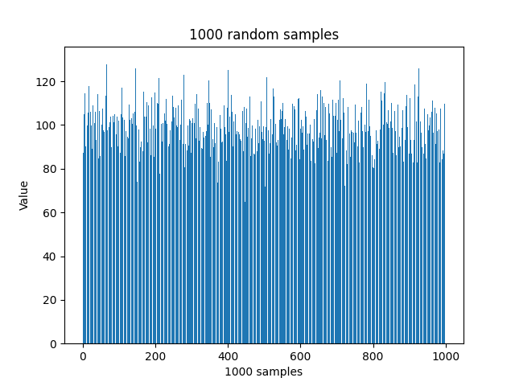

## 第4周作业

#### 1、
每个骰子出现1点的概率$p=\frac{1}{6}$，设X为掷6颗均匀骰子出现1点的次数，则$X\sim B(6, \frac{1}{6})$
$$
\begin{aligned}
    P(X=2)&=C_6^2(\frac{1}{6})^2(\frac{5}{6})^4
    \\&=\frac{3125}{15552}
    \\&\approx0.2009
\end{aligned}
$$
$E(X)=np=1,令\lambda=1,X\sim P(1)则有$
$$
P(X=2)=\frac{1}{2!}e^{-1}\approx0.1839
$$

#### 2、
记$p=2\times10^{-6},n=10^6$,设$X$为访问该网站的人数，$X\sim B(10^6,2\times10^{-6})$
$$
\begin{aligned}
    P(X\ge3)&=1-P(X=0,1,2)
    \\&=1-((1-p)^n+np(1-p)^{n-1}+\frac{n(n-1)}{2}p^2(1-p)^{n-2})
    \\&=0.3233
\end{aligned}
$$
$E(X)=np=2=\lambda$,使用Poisson分布近似,$X\sim P(2)$
$$
\begin{aligned}
    P(X=0,1,2)&=e^{-2}(\frac{2^0}{0!}+\frac{2^1}{1!}+\frac{2^2}{2!})\\&\approx0.6767
    \\P(X\ge3)=1-0.6767=0.3233
\end{aligned}
$$

#### 3、
假设昆虫在一段时间内产卵，不妨将这段时间分成n份，使得其每段时间最多产1个卵
则该昆虫在每段时间的产卵概率为$\frac{\lambda}{n}$，当$n\rightarrow\infty$，即为Poisson分布
由独立性，每段时间产卵并且该卵发育成成虫的概率是
$$
\begin{aligned}
    P&=P(产卵)P(发育成成虫)
    \\&=\frac{\lambda}{n}\times p
    \\&=\frac{\lambda p}{n}
\end{aligned}
$$
因此在n段时间中每段时间产生一个成虫的概率是$\frac{\lambda p}{n}$，由Poisson分布的定义，产生成虫数$k\sim P(p\lambda)$

#### 4、
$$
\left\{
    \begin{aligned}
        \int_{-\infty}^{+\infty}f(x)=1
        \\ \int_{-\infty}^{+\infty}xf(x)=\frac{2}{3}
    \end{aligned}
\right.
$$
解得$a=\frac{1}{3},b=2$
#### 5、
此人不同到达时间对应的等待时间如图：

(1)等待时间不超过10分钟对应的区间为$\{0\}\cup[20,30]\cup[50,60]$
$$P=\frac{20}{60}=\frac{1}{3}$$

(2)等待超过20分钟对应的区间为$(0,10)\cup(30,40)$
$$P=\frac{20}{60}=\frac{1}{3}$$

#### 6、
设$X$为怀孕天数，则某人是孩子父亲$\iff X>290或X<240$
令$Y=\frac{X-\mu}{\sigma}=\frac{X-270}{10}$，$X>290或X<240\iff Y<-3或Y>2,Y\sim N(0,1)$
由正态分布积分可得，$P(Y<-3或Y>2)\approx2.41\%$

#### 7、
指数分布$E(X)=\frac{1}{\lambda}=3,\lambda=\frac{1}{3}$
$$
P(X\ge2.5)=\int_{2.5}^{+\infty}\frac{e^{-\frac{x}{3}}}{3}dx=e^{-\frac{2.5}{3}}\approx0.4346
$$
不换电池跑完全程的概率为0.4346

如果知道其报废前能跑里程的分布函数$F$，不换电池跑完全程的概率为$P(X\ge2.5)=\int_{2.5}^{+\infty}F(x)dx$

#### 8、
(1)
若一个人无罪，则$X\sim Exp(\lambda=1)$
$$
\begin{aligned}
    \int_{0}^c e^{-x}dx&=0.95
    \\1-e^{-c}&=0.95
    \\c&=ln(20)
    \\&\approx2.996
\end{aligned}
$$

(2)
若一个人有罪，则$X\sim Exp(\lambda=0.5)$
$$
\begin{aligned}
    \int_{2.996}^{+\infty} 0.5e^{-0.5x}dx&\approx0.2236
\end{aligned}
$$
将一个确实有罪的被告判为有罪的概率为0.2236

#### 9、
记$X=lnY$，则$Y=e^X$
考虑$Y$的$cdf：$
$$
\begin{aligned}
    P(Y\le y)&=P(e^X\le y)
    \\ &= P(X \le lny)
    \\ &= \int_{-\infty}^{lny} \frac{1}{\sqrt{2\pi }\sigma}e^{-\frac{(x-\mu)^2}{2 \sigma^2}}dx
\end{aligned}
$$
$Y$的pdf为cdf的导数：
$$
pdf=\frac{1}{\sqrt{2\pi }\sigma}e^{-\frac{(lny-\mu)^2}{2 \sigma^2}}\times \frac{1}{y}
$$

#### 10、
(1)
如果$g(x)$单调增
$$
\begin{aligned}
    P(g(X) \le y) &=P(X \le g^{-1}(y))
    \\&=F(g^{-1}(y))
    \\pdf&=\frac{d}{dy}F(g^{-1}(y))
    \\&=f(g^{-1}(y))(g^{-1}(y))'
\end{aligned}
$$
如果$g(x)$单调减
$$
\begin{aligned}
    P(g(X) \le y) &=P(X \ge g^{-1}(y))
    \\&=1-F(g^{-1}(y))
    \\pdf&=-\frac{d}{dy}F(g^{-1}(y))
    \\&=-f(g^{-1}(y))(g^{-1}(y))'
\end{aligned}
$$
(2)
$0\le Y=F(X)\le 1$
$$
\begin{aligned}
    P(Y\le y)&=P(F(X)\le y)
    \\&=P(X\le F^{-1}(y))
    \\&=F(F^{-1}(y))
    \\&=y
\end{aligned}
$$
所以$Y\sim U(0,1)$

(3)
如果$Y\sim U(0,1)$，那么$Y$的$pdf$为$P(Y<y)=y$
$$
\begin{aligned}
    P(F^{-1}(y)\le y)&=P(y\le F(y))
    \\&=F(y)
\end{aligned}
$$

(4)
注：本人没想到有什么应用
对于随机变量$X$，$F(X)\sim U(0,1)$

(5)
不成立，因为如果不严格单调，那么$F^{-1}(y)$不一定存在

#### 11、
(1)
$$
P(Y=1)=p_1
\\P(Y=2)=p_2
\\ \cdots
\\ P(Y\le x)=\sum_{i=1}^x p_i
$$
(2)
可以，该$cdf:P(Y\le x)=\sum_{i=1}^x p_i$满足一般的离散随机变量分布的累积分布函数

#### 12、
断开点坐标x的分布：$x\sim U(0,1)$
包含固定点$P_0$的长度
$$
L=
\left\{
    \begin{aligned}
        1-x,x<p_0
        \\ x, x\ge p_0
    \end{aligned}
\right.
$$
$$
\begin{aligned}
    E(L)&=\int_{-\infty}^{\infty}L\times1dx
    \\&=\int_0^{p_0}(1-x)dx+\int_{p_0}^{1}xdx
    \\&=x-\frac{x^2}{2} \Big|_0^{p_0}+\frac{x^2}{2}\Big|_{p_0}^1
    \\&=p_0-\frac{p_0^2}{2}+\frac{1}{2}-\frac{p_0^2}{2}
    \\&=-p_0^2+p_0+\frac{1}{2}
\end{aligned}
$$

#### 13、
$$
E(X)=0.5\int_0^1dx+0.5\int_3^4dx=2
\\Var(X)=0.5(\int_0^1(x-2)^2dx+\int_3^4(x-2)^2dx)=\frac{7}{3} 
$$

#### 14、
$\beta$分布的$pdf：f(x; \alpha, \beta) = \frac{\Gamma(\alpha + \beta)}{\Gamma(\alpha) \Gamma(\beta)} x^{(\alpha - 1)} (1 - x)^{(\beta - 1)}
$
期望$E(X) = \frac{\alpha}{\alpha + \beta}$
方差$Var(X) = \frac{\alpha \beta}{(\alpha + \beta)^2 (\alpha + \beta + 1)}$

#### 15、
(1)


(2)


(3)
$$
\mu_1=99.777,Var_1=99.069
\\ \mu_2=99.720, Var_2=100.631
$$
二者相对接近

```python
import numpy as np
import matplotlib.pyplot as plt

mean = 100
std_dev = np.sqrt(100)  # 标准差为方差的平方根，此处方差为100
num_samples = 1000

random_samples = np.random.normal(mean, std_dev, num_samples)
# print(random_samples)

plt.bar(range(0, 1000), random_samples)
plt.title("1000 random samples")
plt.xlabel("1000 samples")
plt.ylabel("Value")
plt.savefig("1.png")
plt.clf()

mean1 = np.mean(random_samples)
var1 = np.var(random_samples)

second_samples = []
for i in range(1000):
    select_sample = np.random.randint(0, 1000)
    second_samples.append(random_samples[select_sample])
mean2 = np.mean(second_samples)
var2 = np.var(second_samples)

plt.bar(range(0, 1000), second_samples)
plt.title("1000 second random samples")
plt.xlabel("1000 samples")
plt.ylabel("Value")
plt.savefig("2.png")

print(f"mean1={mean1}, var1={var1}")
print(f"mean2={mean2}, var2={var2}")
```