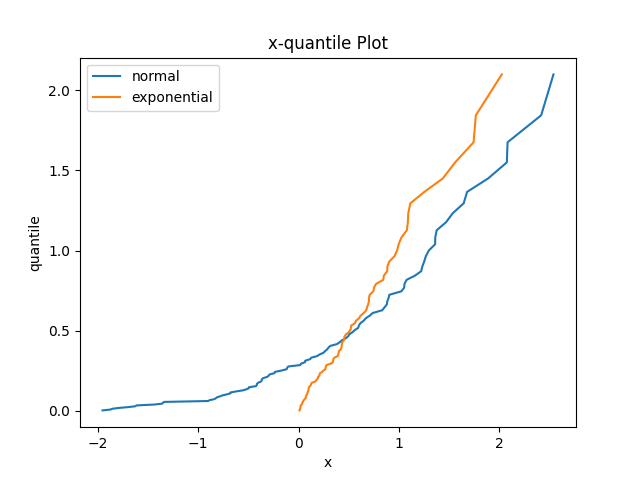

### 第6周作业

#### 1、
$$
\begin{aligned}
    P(Y=k)&=P(X_1+X_2=k)
    \\&=\sum_i P(X_1=k_i,X_2=k-k_i)
    \\&=\sum_i P(X_1=k_i)P(X_2=k-k_i)
    \\&=\sum_i\frac{\lambda_1^{k_i}}{k_i!}e^{-\lambda_1}\frac{\lambda_2^{k-k_i}}{(k-k_i)!}e^{-\lambda_2}
    \\&=\sum_i \frac{\lambda_1^{k_i}\lambda_2^{k-k_i}}{k_i!(k-k_i)!}e^{-(\lambda_1+\lambda_2)}
    \\&=\sum_i C_k^{k_i}\lambda_1^{k_i}\lambda_2^{k-k_i}\frac{e^{-(\lambda_1+\lambda_2)}}{k!}
    \\&=\frac{(\lambda_1+\lambda_2)^k}{k!}e^{-(\lambda_1+\lambda_2)}
\end{aligned}
$$
$可以看出Y\sim P(\lambda_1+\lambda_2)，泊松分布是二项分布n\rightarrow\infty的形式，因此期望具有可加性$

#### 2、
$$
\left\{
    \begin{aligned}
       Z=\frac{Y}{X}
       \\T=X
    \end{aligned}
\right.
$$
(1)
$$
\begin{aligned}
    f'(T,Z)&=f(X,Y)|J|
    \\&=|T|f(T,TZ)
    \\f'(Z)&=\int_{-\infty}^{+\infty}f(T,TZ)|T|dT
    \\&=2\int_{0}^{+\infty}f(T,TZ)TdT
    \\&=\int_{0}^{+\infty}\frac{1}{\pi}e^{-\frac{T^2}{2}(1+Z^2)}TdT
    \\&=\frac{1}{\pi(1+Z^2)}
\end{aligned}
$$

(2)
$$
\begin{aligned}
    g(R,\theta)&=f(x,y)|J|
    \\&=f(R\cos\theta,R\sin\theta)R
    \\&=\frac{1}{2\pi}e^{-\frac{R^2}{2}}R
    \\g(R)&=\int_{0}^{2\pi}g(R,\theta)d\theta
    \\&=e^{-\frac{R^2}{2}}R
    \\g(\theta)&=\int_0^{+\infty}g(R,\theta)dR
    \\&=\frac{1}{2\pi}
    \\g(R,\theta)&=g(R)g(\theta)，所以R,\theta独立
\end{aligned}
$$

(3)
$$
\begin{aligned}
    g(U,V)&=f(x,y)|J|
    \\&=\frac{1}{2}f(\frac{U+V}{2},\frac{U-V}{2})
    \\&=\frac{1}{4\pi}e^{-\frac{U^2+V^2}{4}}
    \\g(U)&=\int_{-\infty}^{+\infty}g(U,V)dV
    \\&=\int_{-\infty}^{+\infty}\frac{1}{4\pi}e^{-\frac{U^2+V^2}{4}}dV
    \\&=\frac{1}{2\sqrt{\pi}}e^{-\frac{V^2}{4}}
    \\对称得g(V)&=\frac{1}{2\sqrt{\pi}}e^{-\frac{U^2}{4}}
    \\g(U,V)&=g(U)g(V),U,V独立
\end{aligned}
$$

#### 3、
$设Y的分布函数为G,Z的分布函数为H$
$$
P(Y\le y)=P(X_1\le y)P(X_2\le y)\cdots P(X_n\le y)
\\G(y)=F(y)^n
\\P(Z\ge z)=P(X_1\ge z)P(X_2\ge z)\cdots P(X_n\ge z)
\\1-H(z)=(1-F(z))^n
\\H(z)=1-(1-F(z))^n
$$

#### 4、
##### 卡方分布
设 $X_1, X_2, \ldots, X_n$ 相互独立，且都服从 标准正态分布 $\mathrm{N}(0,1)$ ，则称随机变量
$$
\chi^2=X_1^2+X_2^2+\cdots+X_n^2
$$
服从自由度为 $\mathrm{n}$ 的 $\chi^2$ 分布，记为 $\chi^2 \sim \chi^2(n)$

##### t分布
设 $X \sim N(0,1), Y \sim \chi^2(n)$ 且 $\mathrm{X}, \mathrm{Y}$ 相互独立, 令
$$
t=\frac{X}{\sqrt{Y / n}}
$$
称 $\mathrm{t}$ 服从的分布为自由度为 $\mathrm{n}$ 的 $\mathrm{t}$-分布，记为 $t \sim t(n)$.

##### F分布
设$X$服从自由度为$n_1$的卡方分布, $Y$服从自由度为$n_2$的卡方分布，且$X，Y$独立，则称随机变量$F=\frac{X⁄n1 }{Y⁄n2 }$服从自由度为$(n1，n2)$的F分布，记为$F\sim F(n1，n2)$。

#### 5、
(1)
$1000\times\frac{5}{100}=50,1000-50=950$
如果A赢了,赔率$\eta_1=\frac{950-500}{500}=0.9$
如果B赢了，赔率$\eta_2=\frac{950-300}{300}=\frac{13}{6}\approx2.17$
如果C赢了，赔率$\eta_3=\frac{950-200}{200}=3.75$

(2)
若赔率为$x$,则获胜概率为$\frac{1}{1+x}$
A的获胜概率为$\frac{1}{1+0.9}=\frac{10}{19}\approx0.526$
B的获胜概率为$\frac{1}{1+13/6}=\frac{6}{19}\approx0.316$
C的获胜概率为$\frac{1}{1+3.75}=\frac{4}{19}\approx0.211$

(3)
$0.526+0.316+0.211>1$，说明投注站更倾向高估每匹马的胜率，从而降低赔率

#### 6、
(1)
错误

$设X,Y服从p=0.5的0-1分布，则Var(X)=Var(Y)=\frac{1}{4},Var(XY)=\frac{3}{16},Var(XY)\neq Var(X)Var(Y)$

(2)
错误

$当X为1维变量，E(X)=\overset{-}{x}, 对数列0，1，3，\overset{-}{x}=1显然不成立$

#### 7、
$$
要证E\left((X-c)^2\right) \geq \operatorname{Var}(X)
\\只要证E(X^2-2cX+c^2)\geq \operatorname{Var}(X)
\\只要证E(X^2)-2cE(X)+c^2\geq E(X^2)-E^2(X)
\\只要证E^2(X)-2cE(x)+c^2\ge 0
\\(E(X)-c)\ge 0显然成立，当且仅当E(X)=c取等
$$

#### 8、
不妨设$c>m$
$$
\begin{aligned}
    E(|X-c|)&=\int_{-\infty}^c(c-x)f(x)dx+\int_{c}^{+\infty}(x-c)f(x)dx
    \\&=\int_{-\infty}^m(c-x)f(x)dx+\int_{m}^c(c-x)f(x)dx+\int_{c}^{+\infty}(x-c)f(x)dx
\end{aligned}
$$
$$
\begin{aligned}
    E(|X-m|)&=\int_{-\infty}^m(m-x)f(x)dx+\int_{m}^{+\infty}(x-m)f(x)dx
    \\&=\int_{-\infty}^m(m-x)f(x)dx+\int_{m}^{c}(x-m)f(x)dx+\int_{c}^{+\infty}(x-m)f(x)dx
\end{aligned}
$$
$$
\begin{aligned}
    E(|X-c|)-E(|X-m|)&=\int_{-\infty}^m(c-m)f(x)+\int_{m}^c(c+m-2x)f(x)dx+\int_{c}^{+\infty}(m-c)f(x)dx
    \\&=0.5(c-m)+\int_{m}^c(c+m-2x)f(x)dx+(0.5(m-c)-\int_{m}^c(m-c)f(x)dx)
    \\&=\int_{m}^c(2c-2x)f(x)dx\ge0
\end{aligned}
$$

#### 9、
$$
对数正态分布的pdf为：f(y)=\frac{1}{\sqrt{2\pi }\sigma}e^{-\frac{(lny-\mu)^2}{2 \sigma^2}}\times \frac{1}{y}
\\
\begin{aligned}
    \\E(Y)&=\int_{0}^{+\infty}yf(y)dy
    \\&=\int_{0}^{+\infty}\frac{1}{\sqrt{2\pi }\sigma}e^{-\frac{(lny-\mu)^2}{2 \sigma^2}}dy
    \\令t=\frac{lny-\mu}{\sigma}，有y=e^{\sigma t+\mu}
    \\&=\int_{0}^{+\infty}\frac{1}{\sqrt{2\pi }\sigma}e^{-\frac{t^2}{2}}d(e^{\sigma t+\mu})
    \\&=\int_{-\infty}^{+\infty}\frac{1}{\sqrt{2\pi }}e^{-\frac{t^2}{2}+\sigma t + \mu}
    \\&=e^\mu+\frac{\sigma^2}{2}
    \\Var(Y)&=\int_{-\infty}^{+\infty}(y-\mu)^2f(y)dy
    \\&=(e^{\sigma^2}-1)e^{2\mu+\sigma^2}
\end{aligned}
$$

#### 11、
$(1)\iff(2)\iff(3)\iff(4)$
$1、2由定义知等价$
$Cov(X,Y)=E(XY)-E(X)E(Y)$
$Var(X,Y)=Var(X)+Var(Y)+2Cov(X,Y)$

#### 12、
$$
\begin{aligned}
    Corr(X,Y)&=E(\frac{X-\mu_1}{\sigma_1}\frac{Y-\mu_2}{\sigma_2})
    \\&=\frac{1}{2\pi\sigma_1 \sigma_2\sqrt{1-\rho^2}}\iint_{\Omega}\frac{X-\mu_1}{\sigma_1}\frac{Y-\mu_2}{\sigma_2}\exp\left(-\frac{1}{2(1-\rho^2)}\left[\frac{(x-\mu_1)^2}{\sigma_1^2}-2\rho\frac{(x-\mu_1)(y-\mu_2)}{\sigma_1\sigma_2}+\frac{(y-\mu_2)^2}{\sigma_2^2}\right]\right)
    \\令m=\frac{X-\mu_1}{\sigma_1},n=\frac{Y-\mu_2}{\sigma_2}
    \\&=\frac{1}{2\pi\sigma_1 \sigma_2\sqrt{1-\rho^2}}\iint_{\Omega}mn\exp (-\frac{m^2-2\rho mn+n^2}{2(1-\rho^2)})\sigma_1\sigma_2dmdn
    \\&=\frac{1}{2\pi\sqrt{1-\rho^2}}\iint_{\Omega}mn\exp(-\frac{(m-\rho n)^2+(1-\rho^2)n^2}{2(1-\rho^2)})dmdn
    \\&=\frac{1}{2\pi\sqrt{1-\rho^2}}\int_{-\infty}^{+\infty}ne^{-\frac{n^2}{2}}dn\int_{-\infty}^{+\infty}me^{-\frac{(m-\rho n)^2}{2(1-\rho^2)}}dm
    \\考虑\mu=\rho n,\sigma^2=1-\rho^2的&一元正态分布,\mu=\int_{-\infty}^{+\infty}x\frac{1}{\sqrt{2\pi}\sigma}e^{-\frac{(x-\mu)^2}{2\sigma^2}}dx
    \\因此\int_{-\infty}^{+\infty}me^{-\frac{(m-\rho n)^2}{2(1-\rho^2)}}dm&=\sqrt{2\pi}\mu\sigma=\sqrt{2\pi}\rho n\sqrt{1-\rho^2}
    \\LHS&=\frac{1}{2\pi\sqrt{1-\rho^2}}\int_{-\infty}^{+\infty}ne^{-\frac{n^2}{2}}dn\sqrt{2\pi}\rho n\sqrt{1-\rho^2}
    \\&=\frac{\rho}{\sqrt{2\pi}}\int_{-\infty}^{+\infty}n^2 e^{-\frac{n^2}{2}}dn
    \\注意到\frac{1}{\sqrt{2\pi}}\int_{-\infty}^{+\infty}n^2 e^{-\frac{n^2}{2}}dn是\mu&=0,\sigma=1的一元正态分布的方差，值为1
    \\LHS&=\rho
\end{aligned}
$$

#### 14、
(1)
$$
E((U-tV)^2)\ge0,\forall t\in R
\\
\begin{aligned}
    \\E((U-tV)^2)&=E(U^2+t^2V^2-2tUV)
    \\&=E(U^2)+t^2E(V^2)-2tE(UV)\ge 0
    \\E(U^2)+t^2E(V^2)&\ge 2tE(UV)
    \\\frac{1}{2}(\frac{E(U^2)}{t}+tE(V^2))&\ge E(UV)
    \\\frac{1}{4}[(\frac{E(U^2)}{t}-tE(V^2))^2+4E(U^2)E(V^2)]&\ge E^2(UV)
    \\E^2(UV) &\le E(U^2)E(V^2)+\frac{1}{4}(\frac{E(U^2)}{t}-tE(V^2))^2
    \\取t^2=\frac{E(U^2)}{E(V^2)}，则有E^2(UV)&\le E(U^2)E(V^2)
    \\等号成立当且仅当U=tV
\end{aligned}
$$

(2)
$$
Corr(X,Y)=E(\frac{X-\mu_1}{\sigma_1}\frac{Y-\mu_2}{\sigma_2})
\\|Corr(X,Y)|^2=|E(\frac{X-\mu_1}{\sigma_1}\frac{Y-\mu_2}{\sigma_2})|^2\le E((\frac{X-\mu_1}{\sigma_1})^2)E((\frac{Y-\mu_2}{\sigma_2})^2)=1
\\等号成立当且仅当\frac{X-\mu_1}{\sigma_1}=t\frac{Y-\mu_2}{\sigma_2}
\\即Y=\frac{\sigma_2}{t\sigma_1}(X-\mu_1)+\mu_2
$$

#### 16、
(1)(2)

(3)
$可以，设\Phi^{-1}是假设的分布cdf的反函数，将数据排序并考察x_i与\Phi^{-1}(\frac{i-1}{n})的线性关系，可以推断是否服从假设的分布$

(4)
$如果数据量足够多，可以拟合出它们的cdf，从而求出反函数并绘制Q-Q图$

