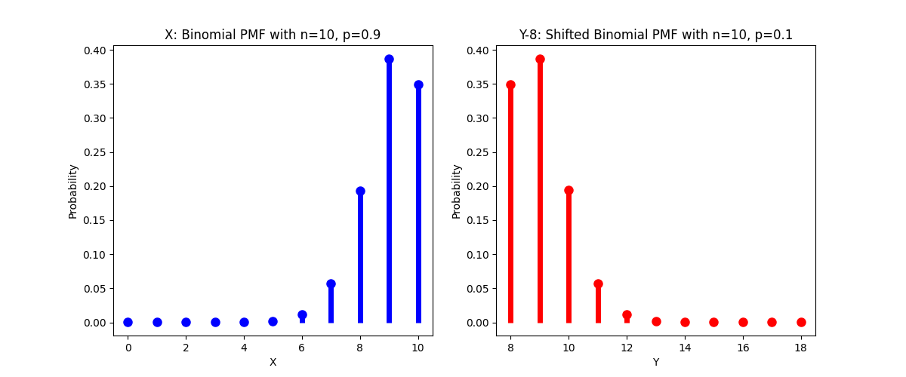
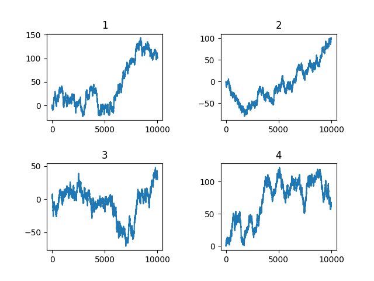

### 第7次作业

#### 1、
(1)

(2)
$$
u(X)=np=10\times0.9=9
\\\sigma^2(X)=np(1-p)=10\times0.9\times0.1=0.9
\\mean(X)=9
\\mode(X)=9
\\u(Y-8)=np=10\times0.1=1
\\u(Y)=9
\\\sigma^2(Y)=np(1-p)=0.9
\\mean(Y)=9
\\mode(Y)=9
$$

(3)
$$
\begin{aligned}
    Skew(X)&=\frac{E[(X-\mu)^3]}{\sigma^3}
    \\&=\frac{E(X^3)-3\mu E(X^2)+3\mu^2 E(X)-\mu^3}{\sigma^3}
    \\&=\frac{E(X^3)-3\mu(\sigma^2+\mu^2)+3\mu^3-\mu^3}{\sigma^3}
    \\&=\frac{E(X^3)-3\mu\sigma^2-\mu^3}{\sigma^3}
\end{aligned}
\\
\begin{aligned}
    E(X^3)&=1^3C_n^1p^1(1-p)^{n-1}+\cdots+n^3C_n^np^n(1-p)^0
    \\&=np\sum_{k=0}^{n-1}C_{n-1}^k(k+1)^2p^k(1-p)^{n-1-k}
    \\&=np\sum_{k=0}^{n-1}C_{n-1}^k(k^2+2k+1)p^k(1-p)^{n-1-k}
    \\&=np[\sum_{k=0}^{n-1}C_{n-1}^kk^2p^k(1-p)^{n-1-k}+2\sum_{k=0}^{n-1}C_{n-1}^kkp^k(1-p)^{n-1-k}+\sum_{k=0}^{n-1}C_{n-1}^kp^k(1-p)^{n-1-k}]
    \\&=np[E(X'^2)+2E(X')+1],X'\sim B(9,0.9)
    \\&=np[\sigma^2(X')+E^2(X')+2E(X')+1]
    \\&=np[\sigma^2(X')+(E(X')+1)^2]
    \\&=10\times0.9[9\times0.9\times0.1+(9\times0.9+1)^2]
    \\&=752.58
    \\E(X^2)&=\sigma^2(X)+E^2(X)
    \\&=np(1-p)+(np)^2
    \\&=0.9+9^2
    \\&=81.9
    \\Skew(X)&=\frac{752.58-3\times9\times0.9-9^3}{0.9^{1.5}}\approx-0.843
    \\由对称性,Skew(Y)&=0.843
\end{aligned}
$$

#### 2、
(1)(2)(3)
$Exp(1)的矩母函数：$
$$
\begin{aligned}
    M_x(t)&=\int_0^{+\infty}e^{tx}e^{-x}dx
    \\&=\int_0^{+\infty}e^{(t-1)x}dx
    \\&=\frac{e^{(t-1)x}}{t-1}\Big|_0^{+\infty}
    \\&=\frac{1}{1-t},t\le 1
    \\M_x^{(1)}&=(t-1)^{-2},M_x^{(1)}(0)=1
    \\M_x^{(2)}&=-2(t-1)^{-3},M_x^{(2)}(0)=2
    \\M_x^{(3)}&=6(t-1)^{-4},M_x^{(3)}(0)=6
    \\M_x^{(4)}&=-24(t-1)^{-5},M_x^{(4)}(0)=24
    \\\mu&=1/1=1,\sigma^2=1,\sigma=1
    \\Skew(X)&=E((X-1)^3)
    \\&=E(X^3)-3E(X^2)+3E(X)-1
    \\&=6-3\times2+3-1
    \\&=2
    \\Kurt(X)&=E((X-1)^4)
    \\&=E(X^4)-4E(X^3)+6E(X^2)-4E(X)+1
    \\&=24-4\times6+6\times2-4+1
    \\&=9
\end{aligned}
$$
$P(4)的矩母函数：$
$$
\begin{aligned}
    M_x(t)&=E(e^{tx})
    \\&=\sum_k e^{tk}\frac{4^k}{k!}e^{-4}
    \\&=e^{-4}\sum_k\frac{(4e^t)^k}{k!}
    \\&=e^{-4}e^{4e^t}
    \\&=e^{4e^t-4}
    \\M_x^{(1)}&=4e^te^{4e^t-4}=4e^{4e^t+t-4}
    \\M_x^{(2)}&=(4e^t+1)4e^{4e^t+t-4}=16e^{4e^t+2t-4}+M_x^{(1)}
    \\M_x^{(3)}&=16(4e^t+2)e^{4e^t+2t-4}+M_x^{(2)}
    \\&=64e^{4e^t+3t-4}+2(M_x^{(2)}-M_x^{(1)})+M_x^{(2)}
    \\M_x^{(4)}&=64(4e^t+3)e^{4e^t+3t-4}+3M_x^{(3)}-2M_x^{(2)}
    \\&=256e^{4e^t+4t-4}+192e^{4e^t+3t-4}+3M_x^{(3)}-2M_x^{(2)}
    \\M_x^{(1)}(0)&=4
    \\M_x^{(2)}(0)&=16+4=20
    \\M_x^{(3)}(0)&=64+2\times16+20=116
    \\M_x^{(4)}(0)&=256+192+3\times116-2\times20=756
    \\Skew(X)&=E(\frac{X-4}{\sigma})^3=(E(X^3)-3E(X^2)+3E(X)-64)/2^3=0.5
    \\Kurt(X)&=E(\frac{X-4}{2})^4=(E(X^4)-16E(X^3)+96E(X^2)-256E(X)+256)/16=3.25
\end{aligned}
$$
$U(0,1)的矩母函数：$
$$
\begin{aligned}
    M_x(t)&=\int_0^{1}e^{tx}dx
    \\&=\frac{e^{tx}}{t}\Big|_0^1
    \\&=\frac{e^t-1}{t}
    \\M_x^{(n)}(0)没有意义
    \\E(X^n)&=\frac{1}{n+1}
    \\\mu=0.5,\sigma^2=\frac{1}{12}
    \\Skew(X)&=E[(\frac{X-0.5}{\sigma})^3]=0(对称性)
    \\Kurt(X)&=E[(\frac{X-0.5}{\sigma})^4]=3.36
\end{aligned}
$$

#### 3、
$f(x)=\frac{1}{3}\times2e^{-2x}+\frac{2}{3}\times3e^{-3x}$

#### 4、
(1)
$$
M_x(t)=\int_0^{+\infty}e^{tx}f(x)dx
\\lim_{x\rightarrow+\infty}e^{tx}f(x)=+\infty，积分不收敛
$$
(2)
$$
\begin{aligned}
    E(Y^n)&=E((e^X)^n)
    \\&=E(e^{nX})
    \\&=M_x(n)
    \\&=e^{\frac{\sigma^2n^2}{2}+\mu n}
\end{aligned}
$$

#### 5、
$$
对X\sim P(\lambda),M_X(t)=e^{\lambda(e^t-1)}
\\
\begin{aligned}
    M_Y(t)&=M_{X_1}(t)M_{X_2}(t)
    \\&=e^{(\lambda_1+\lambda_2)(e^t-1)}
\end{aligned}
\\所以Y\sim P(\lambda_1+\lambda_2)
$$

#### 6、
$X\sim U(0,1),Y\sim U(X,1)$
$$
\begin{aligned}
    E(Y)&=E[E(Y|X)]
    \\&=\int_0^1\frac{x+1}{2}dx
    \\&=\frac{3}{4}
    \\余下长度为1-\frac{3}{4}=\frac{1}{4}
\end{aligned}
$$

#### 7、
$$
t=\frac{1}{3}\times2+\frac{1}{3}\times(t+3)+\frac{1}{3}\times(t+1)
\\t=6
$$

#### 8、
$$
E(E(Y|X))=E(Y)=E(X)
\\
\begin{aligned}
    Cov(X,Y)&=E(X-E(X)(Y-E(Y)))
    \\&=E(X-E(X)(Y-X+X-E(X)))
    \\&=E(X-E(X)(Y-X))+Var(X)
    \\&=\sum_x(x-E(X))E(Y-x|x)+Var(X)
    \\&=\sum_x(x-E(X))E(x-x|x)+Var(X)
    \\&=Var(X)
\end{aligned}
$$
#### 9、
(1)
$$
\begin{aligned}
    E(Y|x)&=\int_{-\infty}^{+\infty}yf_{Y|X}(y|x)dy
    \\&=\int_{-\infty}^{+\infty}yf(y)dy
    \\&=E(Y)
\end{aligned}
$$

(2)
不成立
| |A|B|C|D|
|-|-|-|-|-|
|Y|0|3|1|2|
|X|0|0|1|1|

$E(Y|X)=1.5恒成立，但Y与X不独立$

#### 10、
$$
\begin{aligned}
    Var(\hat{Y})&=E((E(Y|X)-E(E(Y|X)))^2)
    \\&=E((E(Y|X)-E(Y))^2)
    \\&=E(E^2(Y|X))-2E(E(Y|X))E(Y)+E^2(Y)
    \\&=E(E^2(Y|X))-E^2(Y)
    \\Var(\tilde{Y})&=E((\tilde{Y}-E(\tilde{Y}))^2)
    \\因为E(\tilde{Y})=0,&=E(\tilde{Y}^2)
    \\&=E((Y-E(Y|X))^2)
    \\&=E(Y^2)-E(E^2(Y|X))
    \\Var(\hat{Y})+Var(\tilde{Y})&=E(Y^2)-E(Y^2)=Var(Y)
\end{aligned}
$$

#### 11、
(1)
$$
\begin{aligned}
    Var(X|Y)&=E[Y^2-2YE(Y|X)+E^2(Y|X)|X]
    \\&=E(Y^2|X)-2E^2(Y|X)+E^2(Y|X)
    \\&=E(Y^2|X)-E^2(Y|X)
\end{aligned}
$$

(2)
$$
\begin{aligned}
    Var[E(Y|X)]&=E((E(Y|X)-E(E(Y|X)))^2)
    \\&=E((E(Y|X)-E(Y))^2)
    \\&=E(E^2(Y|X)-2E(Y|X)E(Y)+E^2(Y))
    \\&=E(E^2(Y|X))-E^2(Y)
    \\E[Var(X|Y)+Var[E(Y|X)]]&=E(Y^2)-E(E^2(Y|X))+E(E^2(Y|X))-E^2(Y)
    \\&=E(Y^2)-E^2(Y)
    \\&=Var(Y)
\end{aligned}
$$

#### 12、
$E(Y|0.5)=\frac{\sqrt{3}}{4}$

#### 13、
(1)当$\rho>0,a=\frac{\sigma_2}{\sigma_1},b=\mu_2-\frac{\sigma_2}{\sigma_1}\mu_1；当\rho<0，用-\sigma_2替换\sigma_2$

#### 14、
(1)
$$
E(Y)=E(E(Y|X))=\sum_n n\mu p_n=a\mu
$$
(2)
$M_N(t)=\sum_ne^{tn}p_n$

#### 15、
$考虑一个随机变量N，它是一个离散型随机变量，表示要相加的正态随机变量的个数。假设N服从某个离散分布，例如泊松分布$

$考虑一系列独立的标准正态随机变量{X_1, X_2, X_3, ...}，它们都服从N(0, 1)。$

$定义随机变量S，它表示前N个正态随机变量的和，即S = X_1 + X_2 + ... + X_N。在这种情况下，S的分布取决于N的取值，即实际相加的正态随机变量的个数。$

$因为N是随机的，所以S的分布实际上是所有可能的N值下正态随机变量之和的混合分布。也即S的分布是多个正态分布的加权和，其中权重由N的分布决定。在这种情况下，S的分布通常不是正态分布。$

#### 16、
1、
$$
M_x(t)=\sum_ie^{tx_i}p_i=\frac{1}{2}(e^t+e^{-t})
\\M_x(t)^n=\frac{C_n^0e^{tn}+C_n^1e^{t(n-2)}+\cdots+C_n^ne^{-tn}}{2^n}
\\P(X_n=n)=\frac{C_n^0}{2^n}
\\P(X_n=n-2)=\frac{C_n^1}{2^n}
\\\cdots
\\由对称性,E(X_n)=0
\\\begin{aligned}
    \\Var(X_n)&=\frac{1}{2^n}(n^2C_n^0+(n-2)^2C_n^1+\cdots+(-n)^2C_n^n)
    \\&=\sum_{k=0}^n(n-2k)^2C_n^kp^k(1-p)^{n-k},其中p=0.5
    \\&=\sum_{k=0}^n(n^2-4kn+4k^2)C_n^kp^k(1-p)^{n-k}
    \\&=n^2-4nE(X)+4E(X^2),X\sim B(n,0.5)
    \\&=n^2-4n\times0.5n+4(Var(X)+E^2(X))
    \\&=n^2-2n^2+4(n\times0.5\times0.5+n^2\times0.25)
    \\&=n
\end{aligned}
$$
2、

图像会多次在0左右震荡，最大偏离在100左右，与$\sigma^2=10000,\sigma=100$一致