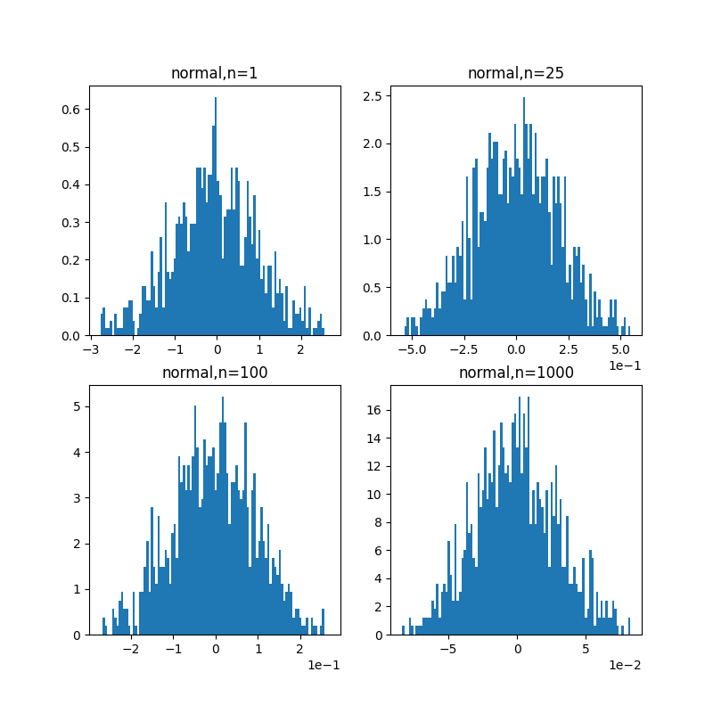
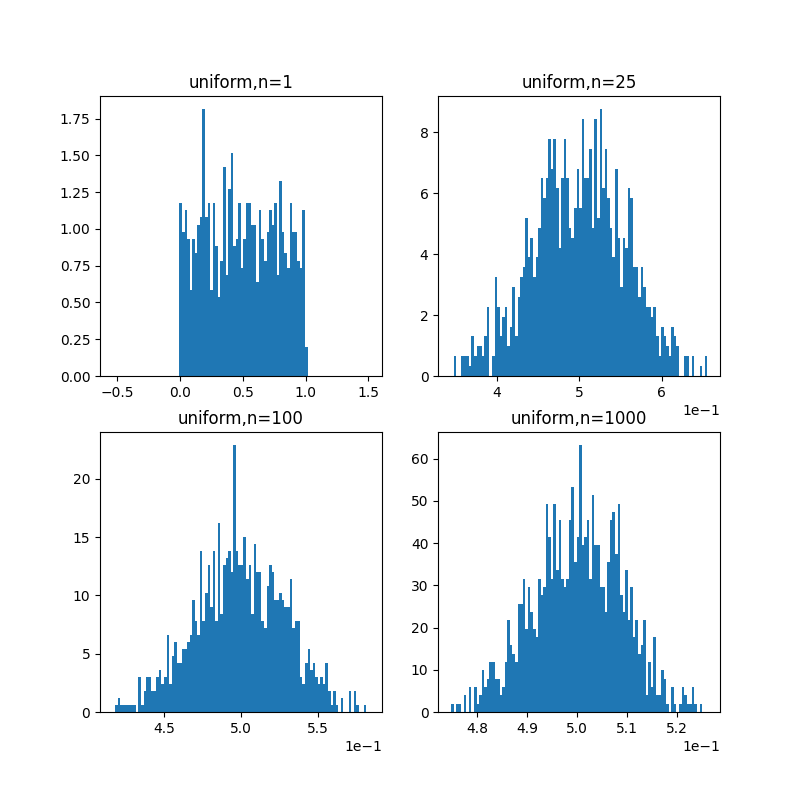
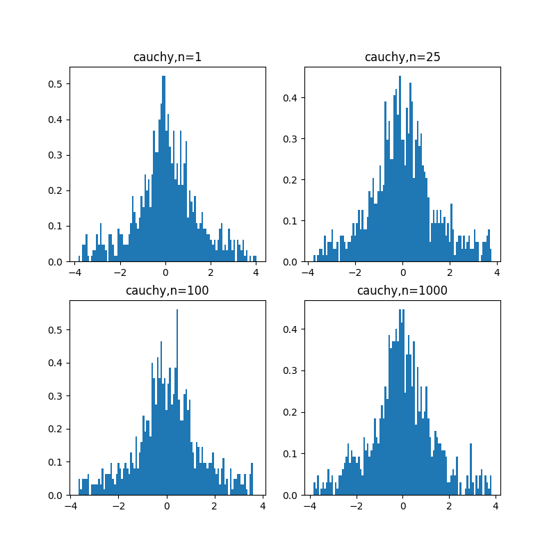

### 第9周作业

#### 1、
$由SLLN,设事件A发生的概率是p(未知)，进行n次实验成功次数为x,lim_{n\rightarrow+\infty}\overline{x}=lim_{n\rightarrow+\infty}\frac{x}{n}=p,频率解释合理$

#### 2、
$设\overline{X}=\frac{1}{n}(X_1+\cdots+X_n)$
$因为X_i两两不相关，Var(\overline{X})=\frac{1}{n^2}\sum_{i}Var(X_i)=\sum_i\frac{\sigma_i^2}{n^2}\le \sum_i \frac{c}{n^2}=\frac{c}{n}$
$由Chebyshev,P(|\overline{X}-E(\overline{X})|\ge \varepsilon)\le \frac{\frac{c}{n}}{\varepsilon^2}=\frac{c}{n\varepsilon^2}\rightarrow0,n\rightarrow0$
$所以\lim _{n \rightarrow \infty} P\left(\left|\frac{1}{n} \sum_{i=1}^n X_i-\frac{1}{n} \sum_{i=1}^n \mu_i\right| \geq \varepsilon\right)=0$

#### 3、
$对X_1,X_2,\cdots,X_n(iid),E(X_i)=\mu,Var(X_i)=\sigma^2,记\overline{X}=\frac{X_1+\cdots+X_n}{n}$
$$由CLT,lim_{n\rightarrow\infty}P(\frac{\overline{X}-\mu}{\sigma/\sqrt{n}}\le x)=\varPhi(x)
\\ \lim_{n\rightarrow\infty}P(\frac{\overline{X}-\mu}{\sigma/\sqrt{n}}> x)=1-\varPhi(x)
\\ \lim_{n\rightarrow\infty}P(\Big|\frac{\overline{X}-\mu}{\sigma/\sqrt{n}}\Big|> x)=2(1-\varPhi(x))
\\ \lim_{n\rightarrow\infty}P(\Big|{\overline{X}-\mu}\Big|> \frac{x\sigma}{\sqrt{n}})=2(1-\varPhi(x))
\\ \lim_{n\rightarrow\infty}P(\Big|{\overline{X}-\mu}\Big|> \varepsilon)=2(1-\varPhi(\varepsilon\frac{\sqrt{n}}{\sigma}))
\\ 对\forall\varepsilon>0,lim_{n\rightarrow\infty}2(1-\varPhi(\varepsilon\frac{\sqrt{n}}{\sigma}))=0
$$

#### 4、
$$
\begin{aligned}
    E(S^2)&=\sigma^2
    \\由chebyshev,P(|S^2-E(S^2)|\ge \varepsilon)&\le \frac{Var(S^2)}{\varepsilon^2}
    \\ Var(S^2)=\frac{1}{n-1}Var(\sum_i(X_i-\mu)^2&-n(\overline{X}-\mu)^2)
    \\ 
\end{aligned}
$$

#### 5、
$A=\{X_n不收敛于a\},B=\{Y_n不收敛于b\},C=\{\frac{X_n}{Y_n}不收敛于\frac{a}{b}\}$
$C\sub (A+B),A,B的测度为0，C的测度也为0$
$所以\frac{X_n}{Y_n}=\frac{a}{b}\ a.s.$

#### 6、
$$
\begin{aligned}
    \frac{X_1+\cdots+X_n}{Y_1+\cdots+Y_n}&=\frac{(X_1+\cdots+X_n)/n}{(Y_1+\cdots+Y_n)/n}
    \\由SLLN,&=\frac{\mu_X}{\mu_Y}=\frac{2}{5}
\end{aligned}
$$

#### 7、
$$
X\sim B(40, 0.5)
\\
\begin{aligned}
    \\P(X=20)&=C_{40}^{20}p^{20}(1-p)^{20}
    \\&\approx0.125
    \\y_1=\frac{20-40\times0.5-0.5}{\sqrt{40\times0.5\times0.5}}&=-0.156
    \\y_2=\frac{20-40\times0.5+0.5}{\sqrt{40\times0.5\times0.5}}&=0.156
    \\令\varPhi为正态分布的cdf,\varPhi(y_2)-\varPhi(y_1)&=0.124
\end{aligned}
$$

#### 8、
(1)
$$
设X为一个买保险人的收益，E(X)=-0.001\times1000+2=1
$$

(2)
$$
10000人的保费为10000\times2=20000
\\20\%毛利润下赔付20000\times(1-20\%)=16000,可理赔16人
\\设X为出事故的人数，X\sim B(10000,0.001)
\\P(X\le 16)\approx0.973
$$

(3)
$$
设f(X)为X\sim B(10000,0.001)的cdf
\\P(X\le m)\ge0.95,m的最大值为15
\\以95\%的概率可以保证还有20000-15\times1000=5000利润
$$


#### 9、
(1)
$$
\\P(\Big|\frac{X_1+X_2+\cdots+X_n}{n}-0\Big|\le \varepsilon)\\
X_i\sim U(-1, 1),Var(X_i)=\frac{(1-(-1))^2}{12}=\frac{1}{3}
\\\sigma^2=\frac{1}{3},\sigma=\frac{1}{\sqrt{3}}
\\P(\frac{\overline{X}}{\sigma/\sqrt{n}}<x)=\varPhi(x)
\\P(\overline{X}<\frac{\sigma x}{\sqrt{n}})=\varPhi(x)
\\令\varepsilon=\frac{\sigma x}{\sqrt{n}},P(\overline{X}<\varepsilon)=\varPhi(\frac{\sqrt{n}\varepsilon}{\sigma})=\varPhi(\sqrt{3})=0.958
\\P(|\overline{X}|<\varepsilon)=1-2\times(1-0.958)=0.916
$$

(2)
$$
P(\overline{X}<0.2)=\varPhi(\sqrt{3n}\times0.2)
\\P(|\overline{X}|<0.2)=1-2(1-\varPhi(0.2\sqrt{3n}))>0.95
\\\varPhi(0.2\sqrt{3n})>0.975
\\0.2\sqrt{3n}>1.96
\\n>32.01,n\ge 33
$$

(3)
$$
E(\overline{X})=0
\\Var(\overline{X})=\frac{\sigma^2}{n}=\frac{1}{3n}
\\P(|\overline{X}|\ge \varepsilon)\le \frac{Var(\overline{X})}{\varepsilon^2}
\\P(|\overline{X}|\ge 0.2)\le \frac{1/3n}{0.04}=0.05
\\n=3.75,n\ge 4
\\Chebyshev相对CLT误差更大
$$

#### 10、
$$
设X_i=
\left\{
    \begin{aligned}
    0&,不合格品
    \\1&,合格品
    \end{aligned}
\right.
\\\overline{X}=\frac{X_1+\cdots+X_n}{n},n=5000
\\X_1+\cdots+X_n\sim B(n,0.8),\mu=0.8,\sigma^2=p(1-p)=0.16
\\由CLT,Y=\frac{\overline{X}-\mu}{\sigma/\sqrt{n}}=\frac{\overline{X}-0.8}{\sqrt{0.16}/\sqrt{5000}}=176.8(\overline{X}-0.8)
\\Y\sim N(0,1)
\\P(Y\le x)=\varPhi(x)
\\P(\overline{X}-0.8\le \frac{x}{176.8})=\varPhi(x)
\\令\varepsilon=\frac{x}{176.8},P(\overline{X}-0.8\le \varepsilon)=\varPhi(176.8\varepsilon)\ge 1-\frac{\alpha}{2}=0.995
\\176.8\varepsilon>2.576
\\\varepsilon>1.46\%
\\合格品数量=5000\times[80\%-1.46\%,80\%+1.46\%]=[3927,4073]
$$

#### 11、
“2015年度西南大学财经学院40000户抽样调查显示，中国基尼系数达到了0.62”
由于CLT,相对理论真值的误差仅近取决于测量次数，而与总数无关，因此在全国14亿中尽管只采样40000户，依然能获得极高的精度

#### 12、
(1)
$$
设X_i=
\left\{
    \begin{aligned}
    0&,下降50\%
    \\1&,上涨70\%
    \end{aligned}
\right.
\\
\\设\overline{X}=\frac{X_1+\cdots+X_n}{n}
\\X=X_1+\cdots+X_n=n\overline{X}
\\Y_n=1.7^{X}0.5^{n-X}
\\
\begin{aligned}
    log(Y_n)&=Xlog3.4+nlog0.5
    \\&=n\overline{X}log3.4-nlog2
    \\E(\overline{X})=0.5,Var(\overline(X))=&0.5(1-0.5)=0.25
    \\由CLT,\frac{\overline{X}-0.5}{0.5/\sqrt{n}}&\sim N(0,1)
    \\\overline{X}&\sim N(0.5,\frac{0.25}{n})
    \\log(Y_n)&\sim N(0.5nlog3.4-nlog2,0.25nlog^23.4)
    \\log(Y_n)&\sim N(-0.0813n,0.3744n)
\end{aligned}
$$
(2)
$$
当n\rightarrow\infty,E(log(Y_n))\rightarrow-\infty
\\E(Y_n)=e^{\mu+\sigma^2/2}=e^{0.1059n}\rightarrow+\infty
$$
(3)
$$
\begin{aligned}
    \forall\varepsilon>0,Y_n\le \varepsilon&\iff log(Y_n)\le log(\varepsilon)
    \\&\iff\frac{log(Y_n)+0.0813n}{\sqrt{0.3744n}}\le \frac{log(\varepsilon)+0.0813n}{\sqrt{0.3744n}}
    \\&\iff Z\le \frac{log(\varepsilon)}{\sqrt{0.3744n}}+0.1329\sqrt{n},Z\sim N(0,1)
    \\P(Z\le \frac{log(\varepsilon)}{\sqrt{0.3744n}}+&0.1329\sqrt{n})=\varPhi(\frac{log(\varepsilon)}{\sqrt{0.3744n}}+0.1329\sqrt{n})
    \\当n\rightarrow\infty,P(Y_n\le 0)&=\varPhi(+\infty)=1
\end{aligned}
$$

(4)
$$
尽管P\left(\lim _{n \rightarrow \infty} Y_n=0\right)=1，但对于Y_n\neq0的部分由于Y_n过大，导致期望不为0
$$
#### 14、
(1)


(2)


(3)


(4)
$相符，随着n的增大，\overline{X}愈发集中$

```python
import numpy as np
from scipy.stats import cauchy
import matplotlib.pyplot as plt

def Gen(type='normal', N=1000):
    X1 = []
    X25 = []
    X100 = []
    X1000 = []
    for i in range(N):
        if type=='normal':
            X = np.random.normal(0, 1, N)
        elif type=='uniform':
            X = np.random.uniform(0, 1, N)
        elif type=='cauchy':
            X = cauchy.rvs(loc=0, scale=1, size=N)
        else:
            raise TypeError('Invalid distribution type')
        X1.append(X[0])
        X25.append(np.mean(X[0:25]))
        X100.append(np.mean(X[0:100]))
        X1000.append(np.mean(X[0:1000]))
        
    X1 = np.array(X1)
    X25 = np.array(X25)
    X100 = np.array(X100)
    X1000 = np.array(X1000)
    
    q1 = [0 for _ in range(4)]
    q3 = [0 for _ in range(4)]
    iqr = [0 for _ in range(4)]
    
    q1[0], q3[0] = np.percentile(X1, [25, 75])
    iqr[0] = q3[0] - q1[0]
    
    q1[1], q3[1] = np.percentile(X25, [25, 75])
    iqr[1] = q3[1] - q1[1]
    
    q1[2], q3[2] = np.percentile(X100, [25, 75])
    iqr[2] = q3[2] - q1[2]
    
    q1[3], q3[3] = np.percentile(X1000, [25, 75])
    iqr[3] = q3[3] - q1[3]
    
    q1 = np.array(q1)
    q3 = np.array(q3)
    iqr = np.array(iqr)
    
    lower_bound = q1 - 1.5 * iqr
    upper_bound = q3 + 1.5 * iqr
    
    fig, axs = plt.subplots(2, 2, figsize=(8, 8))
    axes = axs.flatten()
    
    axs[0, 0].hist(X1, bins=100, density=True, range=(lower_bound[0], upper_bound[0]))
    axs[0, 0].set_title(f'{type},n=1')
    
    axs[0, 1].hist(X25, bins=100, density=True, range=(lower_bound[1], upper_bound[1]))
    axs[0, 1].set_title(f'{type},n=25')

    axs[1, 0].hist(X100, bins=100, density=True, range=(lower_bound[2], upper_bound[2]))
    axs[1, 0].set_title(f'{type},n=100')

    axs[1, 1].hist(X1000, bins=100, density=True, range=(lower_bound[3], upper_bound[3]))
    axs[1, 1].set_title(f'{type},n=1000')
    
    for i in range(4):
        axes[i].ticklabel_format(style='sci', axis='x', scilimits=(0, 0))

    plt.savefig(f'{type}.png')
    plt.clf()
        
Gen('normal')
Gen('uniform')
Gen('cauchy')